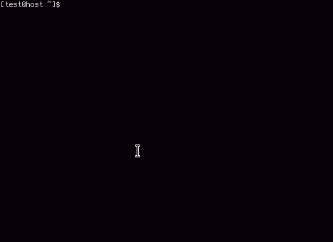

# A must-be catchy header

First ssh login to new server? Miss your dot files? Want to be able to get them fast and manage them easily? Keep reading...

# Problem?

Dotman tries to solve a problem of managing personal dot files (or any kind of 'git-able' data meant to live in users homedirs for sake being).


The idea of storing dot files in a git repository is not a new one. The problem arises when destination machine doesn't have git installed, or you realise that you only want a subset of your configuration.

# Can I haz solution?

Dotman is small program which connects to given git repository, clones it and shares it over http, with bash friendly CLI. Packages of dotfiles are represented by folders in root of given git repository and presented as select list in CLI.
Dotman supports two dotfiles install methods:
 - files copy: each file from selected package is downloaded relative to current user home directory. Needs only bash and curl
 - git symlinks: if git is present, you can choose to download whole repository. Dotman will create all necessary folders and symlinks according do their. This way you can easily push any changes in dotfiles using standard git.


# Less talk, more action!

Underneath demo has following file structure in connected git repository:
<center>
```
.
├── bash_aliases
│   └── .bash_aliases
├── bashrc
│   └── .bashrc
├── BetterBash
│   ├── .bshell
│   │   ├── bb.sh
│   │   └── git-prompt.sh
│   └── .inputrc
├── mc
│   └── .config
│       └── mc
│           ├── ini
│           └── panels.ini
├── README.md
├── tags.yaml
└── vim
    └── .vimrc
```

</center>

# Want faster? - or, how tags work. 

Often you'll install same group of packages on different kind of machines. For instance, you'll probably want to install vim and bash configuration at once on any host you work on, but you wouldn't need mplayer/mpv at work (right?).

Dotman allows you to group packages and install them using single tag. To configure tags, put tags.yaml file in root of your git repository containing dictionary. Each entry should have tagname as key, and list of folders in repository (packages) as value, like so:
```
tags:
  work:
    - bashrc
    - screen
    - vim
  home:
    - mpv
    - mplayer
    - bashrc
    - screen
    - vim
```

Install packagee with tags by using `/t/tagname endpoint`. It'll skip menu and go straight to downloading files.

# Installation
## Dotfiles GIT repo
For starters you'll have to own a git repository being available either by HTTP(S) or SSH protocol. It should consist of folders grouping same kind of dot files. Each folder will be available as a selection in dotman menu. When using dotmans CLI, files inside selected folders (packages) will be downloaded relative to users home folder. 

## Quick start
If you have docker and docker-compose, you're in luck! All you need is to configure one or two variables in env file.

Here's an example of minimal configuration using either of git supported protocols:
### SSH
```
URL=ssh://git@github.com:username/dotfilesrepo.git

```
### HTTP/HTTPS
```
URL=https://username@github.com/username/dotfilesrepo.git
PASSWORD=repository_access_password
```
Now just `docker-compose up` and see the magic happen. On first run, dotman will generate SSH key pair and print publick key on standard output. Allow it to access your repository in order to use ssh connection.

Make sure dotman loaded repository correctly, by viewing the logs. If so you're ready to go!
```
curl 127.0.0.1:1338 | bash -
```
## Configuration in depth
All configuraion variables can be provided either as environment variables or as program arguments. The choice is yours. Here's a description of all of them:
| Environment variable | Argument | Default Value | Description |
| --- | --- | --- | --- |
| URL | -url | | URL to git repository containing dot files. Can be either http://, https:// or ssh:// protocol |
| BASEURL | -baseurl | http://127.0.0.1:1338" | URL prefix which will be used for generating download links. It should be the exact URL under which dotman is served. Use https if you put dotman behind SSL terminator |

 # Security
 
 I know what some of you are thinking now: http://whatever.net | sh - pattern is a very ugly one. True. That's I want to make it clear: unless you're doing test on disposable virtual machine, or doing it on localhost, you're forbidden to use it without correctly configured TLS. For crying out load, it's your shell you're giving access to. You wouldn't let tandom guy put commands on your terminal, would you?
