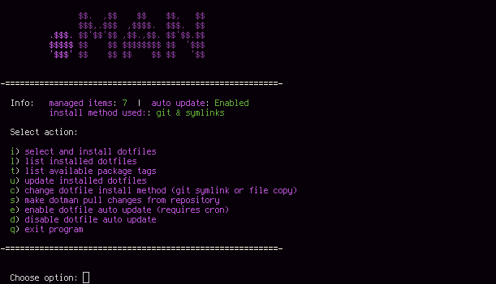

# Introduction to Dotman

If you ever SSH'ed to a brand new server and wished you already had your dot files available, you just found the right tool.

While dotfiles were the original inspiration for this tool, Dotman is not limited to those. Any files (usually of configuration nature) suitable to be stored in a Git repository with intention of placing them in users home directory are suitable for use with the tool.

The idea of storing configuration files in a Git repository is not a new one. However, the problem arises when a destination machine does not have Git installed or you only require a subset of your configuration set.

# How it works

On typical use case, you'd type `curl yourdomain.net/dotmanendpoint | bash -` in your terminal to show ineteractive menu, where you choose which dotfiles you want to install. You can choose by selecting packages (folders) or by configurable tags.

Configuration and maintanance is also dead simple. You organise your dotfiles, by creating a folder for each application you'd like to manage and putting it's configuration files inside. Store each of such folders in root of single Git repository of your choice. When installing dotfiles using Dotman, content of each selected folder is copied in respect to install path ($HOME be default).

If Git is present, you can choose to download the whole repository. In such case, Dotman creates symlinks to files from selected packages (folders) instead of copying them. This way you can easily push any changes to your configuration files using standard Git.

# Demo

In this demo we use Dotman to download Bash, MC, Screen and Vim configuration files using the file copy method. We then switch to the Git symlink method. The diagram below shows Git repository structure served by dotman on left, and file structure after installation on destination computer on the right.

```
.                                      .
├── bashrc                             └── home
│   ├── .bshell                            └── test
│   │   ├── bb.sh                              ├── .bshell
│   │   └── git-prompt.sh                      │   ├── bb.sh
│   ├── .bashrc                                │   └── git-prompt.sh
│   └── .inputrc                               ├── .config
├── mc                       TRANSFORMS        │   └── mc
│   └── .config            ------------->      │       ├── ini
│       └── mc                TO THIS          │       └── panels.ini
│           ├── ini                            ├── .bashrc
│           └── panels.ini                     ├── .inputrc
├── mplayer                                    ├── .screenrc
│   └── .mplayer                               └── .vimrc
│       └── config
├── screen
│   └── .screenrc
├── vim
│   └── .vimrc
└── README.md
```


# Quick start

To get Dotman, you can use one of the following methods:
- download dotman binary from https://github.com/czoczo/dotman/releases
- clone this repository and compile with `go build`
- clone this repository and use `docker-compose build` to create a container

If running the binary, start with:
`./dotman -url https://github.com/czoczo/dotman-example-repo`

If using the container, start with:
`docker-compose up`

That's it! Check it by running:
```
curl localhost:1338 | sh -
```

# Setting own dotfiles repository
Create a Git repository on a server of your choice with preferred folder structure and your conguration files. You can use https://github.com/czoczo/dotman-example-repo as an example. Git repository might be set as public or private - your choice!

Most git servers offer at least two possible connection protocols: HTTP or SSH - both are supported by Dotman. Just remember to use proper prefix when setting URL like on the examples below.

## HTTP/HTTPS
Public
```
URL=https://github.com/username/dotfilesrepo.git
```

Private
```
URL=https://username@github.com/username/dotfilesrepo.git
PASSWORD=repository_access_password
```

## SSH
```
URL=ssh://git@github.com:username/dotfilesrepo.git
```

Now just run `dotman` and let the magic happen. When using ssh protocol, Dotman will generate SSH key pair and print the public key on standard output. Allow this key to access your repository in order to use the SSH connection.

If you're connecting to given repository for the first time, you're going to get this error: "error: ssh: handshake failed: knownhosts: key is unknown". Run `dotman` with `-sshaccept=true` once, to add remote key to known hosts.

Make sure dotman loaded the repository correctly by viewing the logs. If it has, you're ready to go!

# Extra features

## Grouping with tags

You will probably install the same group of packages on diffent machines. For instance, installing vim and bash configuration files go along nicely, but you may not want mplayer/mpv at work (right ;)?).

Dotman lets you group packages and install them at once using a tag. To configure tags, put config.yaml file in root of your Git repository. Each entry should have a tagname as key and list of folders in repository (packages) as value, like so:
```
tags:
  work:
    - bashrc
    - screen
    - vim
  home:
    - mpv
    - mplayer
    - bashrc
    - screen
    - vim
```

Install packages with a tag by using `http://myserver.net/t/tagname` endpoint. It'll skip menu and go straight to downloading files.

## Eliminate manual work - word or two about autorun
Every now and then, there is a need to run some commands after modifying dotconfigs. Whether it's a window manager configuration reload or evaluating some dynamic values for your config, just script it in bash! Name it dotautorun.sh and put it inside git folder holding your applications dotfiles. It will be automatically executed during the deployment of that package.

## Useful endpoints
Dotman's CLI is pretty elastic. Some HTTP endpoints can be useful outside CLI. You can call them using curl. If you use secret, pass it inside HTTP header like in examples below.

### Update configuration files
To update all local configuration files managed by Dotman, run:
```
curl -H"secret:myterriblesecret" http://myserver.net/update
```

### Update cache
After making changes to your repository, you can refresh the file server of Dotman by running:
```
curl -H"secret:myterriblesecret" http://myserver.net/sync
```

## Keep up with repo - what is auto update?
One of Dotman's menu options is enabling dotfiles auto update. This function adds curl request to `/update` endpoint to cron, so your configuration files will be updated every hour. Disable by either deleting line in crontab or using "disable auto update" option.

# Other solutions comparison
Dotman is not the first attempt of humanity to manage dotfiles. In fact there are dozens of such applications/frameworks. If you haven't yet seen website http://dotfiles.github.io/, I strongly recommend you check it out. Maybe a different tool will suit your needs better.

But before you go, I want to point out some strengths of Dotman:
* it doesn't require Git on the host you want to deploy dotfiles to
* you don't have to remember any commands - it has intuitive interface
* almost effortless configuration
* server written in golang - portable binary
* capable of autoupdating dotfiles using cron 
* when installed, leverage standard Git workflow to update dotfile contents

# Configuration in depth
All configuration variables can be provided either as environment variables or as program arguments. Here's a description of all of them:

| Environment variable | Argument | Type | Default Value | Description |
| ----- | ----- | ----- | ----- | ----- |
| URL | -url | string | - | URL to git repository containing your configuration files. Can be either http://, https:// or ssh://. |
| BASEURL | -baseurl | string | 'http://127.0.0.1:1338' | URL prefix which will be used for generating download links. It should be the exact URL under which Dotman is served. Use https if you put Dotman behind SSL terminator. |
| INSTALLPATH | -installpath | string | '$HOME' | Files in your package folders will be installed relative, to this location. |
| SSHKEY | -sshkey | string | ssh_data/id_rsa | Path to SSH key used to connect to git repository when using SSH connection. |
| SSHACCEPT | -sshaccept | boolean | - | Whether to add SSH remote server key to known_hosts. Use it whenever you are binding Dotman with a new repository over SSH. |
| PASSWORD | -password | string | - | Password to use when connecting to git repository over HTTP protocol |
| PORT | -port | integer | 1338 | Port on which Dotman should listen to. If you are using it in production, you will most likely set it to port 80. If you pick a different port, make sure your firewall allows incoming connections. |
| SECRET | -secret | string | - | If set, Bash CLI will ask for secret and all dotfiles will be protected by it. |
| PULLINTERVAL | -pullinterval | integer | 0 | Amount of time in seconds to wait between checks for new commits in remote repository. Defaults to 0 (disabled) |
| URLMASK | -urlmask | string | - | If using containers your URL variable might be different than the one you would like to be set when using git & symlink install method. Use this variable to override URL in cloned repository. |

# Security

## Considrations
I understand some of you, especially those more security saavy, may not be happy with the `http://yourdomain.test | sh -` pattern. Therefore I would like to make it very clear that, unless you are doing a test on disposable VM or doing a test on localhost, you MUST NOT use this pattern without correctly configured TLS in front of Dotman.

## Password protection
Sometimes you might find yourself storing some sensitive data in configuration files, or not being too keen to share them publicly for any reason. For such cases, you can set 'secret' option. It will make Dotman ask for this secret when trying to access CLI. In fact, it will expect secret string to appear in header of any other HTTP request made to Dotman, thus protecting your configuration files from being viewed by unauthorized users. 

## Reporting
If you discover any security-related issues, please email [mr.czoczo@gmail.com] instead of using the issue tracker.

# License
[GNU Affero General Public License v3.0](LICENSE)
